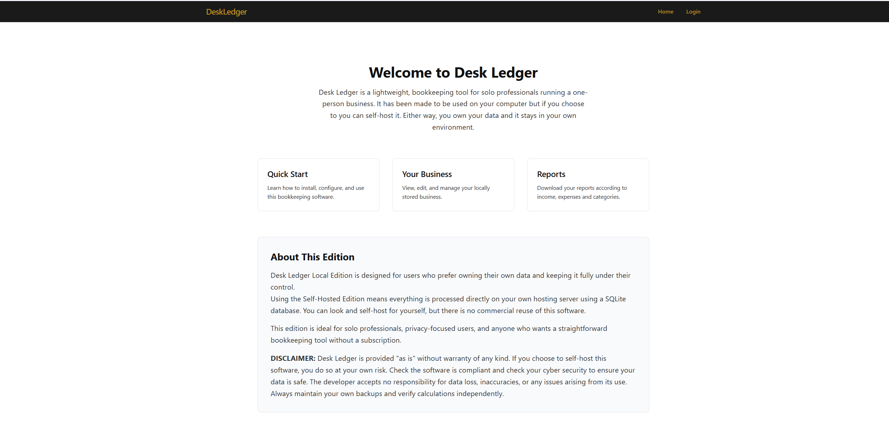

# DeskLedger

<p align="center">
  <a href="https://www.djangoproject.com/">
    
  </a>

  <a href="https://tailwindcss.com/">
    
  </a>

  

  

  

  

</p>

<p align="center">
  <strong>Desk Ledger</strong><br>
  A lightweight, local-first bookkeeping tool for sole professionals and the self-employed.
</p>

<p align="center">
  <a href="#features">Features</a> •
  <a href="#quick-start">Quick Start</a> •
  <a href="#desktop-app-windows">Desktop App</a> •
  <a href="#local-development">Local Development</a> •
  <a href="#documentation">Documentation</a>
</p>

---

## Overview

DeskLedger is a Django-based bookkeeping application designed specifically for a one-person business: solo professionals and the self-employed. It provides a simple, privacy-focused way to track income, expenses, and VAT—all while keeping your data under your complete control.

It is **local-first**: it runs on your own machine as a standalone Windows app, and your books never leave your computer.

> **Use at your own risk.** You download and use DeskLedger at your own risk. It is bookkeeping software, not accounting, tax or legal advice. See the full [disclaimer](#disclaimer) at the end of this page.

**Key Principles:**

- **You own your data** — Everything is stored locally in SQLite
- **Privacy first** — No cloud, no accounts to sign up for, no data sharing. The one optional exception is receipt scanning (OCR): if you turn it on and add your own Anthropic or OpenAI key, the receipt image you scan is sent to that provider
- **Simple and focused** — Built for solo professionals, not enterprise accounting
- **UK tax year aware** — Automatically handles April-to-April tax years and UK dates.

## Features

- **Transaction Management** — Track income and expenses with categorisation
- **VAT Calculations** — Automatic VAT rate application and tracking
- **Quarterly Summaries** — View your finances by tax quarters (Q1-Q4)
- **Tax Year Reports** — Year-to-date profit/loss statements
- **CSV Exports** — Export all your data when needed
- **Receipt Storage** — Attach receipt images to expenses
- **Recurring Entries** — Set up automatic monthly transactions
- **Currency Symbol** — Choose £, € or $ in Settings (a display setting only; amounts are not converted)
- **Native Desktop App** — Run as a standalone Windows app in its own window — no browser required (see [Desktop App](#desktop-app-windows))
- **Daily Backups** — The first time you open DeskLedger each day it copies your database into `data/db/backups/` and keeps 90 days of copies. You can also make a backup by hand at any time (see [Backups](#backups))

### One copy, one business

DeskLedger is built for **one person and one business per copy**. It does not support several users or several businesses in the same copy. Multi-business and multi-user support are open as ideas for contributors (see [CONTRIBUTING.md](CONTRIBUTING.md)).

### Admin Interface

DeskLedger uses [Adminita](https://github.com/djangify/adminita), a clean and modern Django admin theme. Adminita provides a new look for the Django admin panel with improved typography, spacing, and visual hierarchy.

## Quick Start

DeskLedger is for **Windows 10 and 11 only**. It is not available for macOS or Linux. It is designed to run on your own Windows computer, and there are two ways to run it:

| Method | Best For | Difficulty |
|--------|----------|------------|
| [Desktop App (Windows)](#desktop-app-windows) | A standalone Windows app for non-technical users — no Python needed | Easy |
| [Local Development](#local-development) | Running from source on Windows, testing, or personal use on your computer | Easy |

> Prefer to run DeskLedger on a server instead? That's not covered here by design — DeskLedger is built for local, single-user use. If you want to host it yourself, it's an ordinary Django app and you can wire up your own server setup.

---

## Local Development

Run DeskLedger locally on your machine from source. This runs the Django development server, which is perfect for single-user use.

### Prerequisites

- Python 3.11 or higher (3.13 is tested). On Windows, tick **Add Python to PATH** when installing.
- pip (comes with Python)
- Git (only if you clone; you can also download the ZIP from GitHub)

### Easiest way on Windows

Double-click **`start.bat`**. It creates a `venv` folder, installs everything, sets up the database, creates your first login and opens your browser. The first login's random password is printed in the black window and saved to `data\first_login.txt` (see [Your password and keeping your books safe](#your-password-and-keeping-your-books-safe)).

### Step by step (Windows)

1. **Get the code**

   ```bash
   git clone https://github.com/djangify/deskledger.git
   cd deskledger
   ```

2. **Create a virtual environment** (a private folder for DeskLedger's libraries; it is named `venv` and is ignored by git)

   ```bash
   python -m venv venv
   venv\Scripts\activate
   ```

3. **Install dependencies**

   ```bash
   pip install -r requirements.txt
   ```

4. **(Optional) create an environment file**

   ```bash
   copy .env.example .env
   ```

   You can skip this step. DeskLedger creates its own secret key and encryption key on first run and stores them in `data/`. See [Configuration](#configuration) if you want to change anything.

5. **Create the database**

   ```bash
   python manage.py migrate
   ```

6. **Create your first login**

   ```bash
   python manage.py create_default_user
   ```

   This creates the login `demo@example.com` with a **random password**. The password is printed once on screen and saved to `data/first_login.txt`. Change it straight away (see below).

   Prefer your own email and password? Run `python manage.py createsuperuser` instead.

7. **Collect static files**

   ```bash
   python manage.py collectstatic --noinput
   ```

8. **Run the development server**

   ```bash
   python manage.py runserver
   ```

9. **Open the app** at http://127.0.0.1:8000 (admin panel: http://127.0.0.1:8000/admin)

### Running on a different port

```bash
python manage.py runserver 8080
```

### Sharing on your network (not recommended)

DeskLedger is meant to be reached **only from the computer it runs on**. If you choose to open it to your home network anyway (phone, tablet, second computer):

1. Add your computer's local IP to `ALLOWED_HOSTS` in `.env`, e.g. `ALLOWED_HOSTS=localhost,127.0.0.1,192.168.1.100`
2. Run `python manage.py runserver 0.0.0.0:8000`

Understand the risk before you do this: everyone on that network can then reach your login page over plain, unencrypted http. Only do it on a network you fully trust, **never** with the first-login password, never on public or shared Wi-Fi, and stop the server when you have finished. Receipts are protected (you must be logged in to see them), but the connection itself is not encrypted.

---

## Desktop App (Windows)

DeskLedger can run as a true **local-first desktop application** — it opens in its own native window (no browser, no address bar) and can be packaged into a single standalone `.exe` that needs **no Python installation** on the end user's machine.

Under the hood this uses [PyWebView](https://pywebview.flowrl.com/) for the window, [waitress](https://docs.pylonsproject.org/projects/waitress/) as the local server, and [PyInstaller](https://pyinstaller.org/) to bundle everything (Python, Django, your code) into one folder.

### Run it in its own window (for yourself)

Double-click **`start_desktop.bat`**, or from a terminal:

```bash
python desktop.py
```

This sets up the virtual environment, applies migrations, starts the local server, and opens DeskLedger in a desktop window. The first launch also creates your first login (see below).

### Build a standalone `.exe` (to share with others)

Double-click **`build_exe.bat`**, or run it from a terminal:

```bash
build_exe.bat
```

This installs dependencies and PyInstaller, collects static files and third-party licence texts, and runs PyInstaller using `deskledger.spec`. When it finishes you'll have:

```
dist/DeskLedger/DeskLedger.exe
```

**To distribute:** zip the **entire `dist/DeskLedger` folder** and share the zip. The `.exe` needs the `_internal` folder beside it, so don't send the `.exe` on its own. Leave the licence files the build adds beside the `.exe` (`LICENSE.txt`, `THIRD_PARTY_NOTICES.md` and the `third_party_licenses` folder): the licences of the open-source libraries inside the `.exe` require them to travel with it. End users just unzip and double-click `DeskLedger.exe` — no Python, no setup. A simple guide for them is in **[HOW-TO-OPEN-DESKLEDGER.md](HOW-TO-OPEN-DESKLEDGER.md)**.

> DeskLedger is MIT licensed (see [License](#license)). Keep the licence files with the `.exe` when you pass it on.

### First login

The first time the app starts it creates one login and opens a small Notepad window showing the **email** (`demo@example.com`) and a **random password**. The same details are saved in `first_login.txt` inside your data folder (see below). Log in, change the password, then **delete `first_login.txt`**. All of the steps, and what to do if you forget the password, are in [Your password and keeping your books safe](#your-password-and-keeping-your-books-safe).

(To choose the login yourself when running from source, set `DEFAULT_USER_EMAIL` / `DEFAULT_USER_PASSWORD` in `.env` before first run. The packaged `.exe` always generates a random password.)

### Where your data lives

| Run mode | Database & receipts location |
|----------|------------------------------|
| `start_desktop.bat` / `python desktop.py` (dev) | `data/` inside the project folder |
| Packaged `DeskLedger.exe` | `%LOCALAPPDATA%\DeskLedger` (persists across app updates) |

The packaged app keeps user data **outside** the program folder so it survives reinstalls and isn't lost when you replace the app with a new build.

### Requirements & notes

- **Windows 10 or 11.** The build is Windows-only — it must be built *on* Windows, and the resulting `.exe` runs only on Windows. DeskLedger is not available for macOS or Linux.
- PyWebView uses the **WebView2** runtime, which ships with Windows 11 and most updated Windows 10 machines. On a rare PC without it, Windows offers it as a free one-time download.
- New apps trigger a **"Windows protected your PC"** SmartScreen warning. This is normal for unsigned indie software — click **More info → Run anyway**. This is covered in the end-user guide.
- The app icon is read from `static/images/deskledger.ico` (referenced by `deskledger.spec`). Replace that file to change the icon.
- On Windows `requirements.txt` installs `python-magic-bin`, which bundles the file-type library DeskLedger needs. Do not also install `python-magic` by hand: the two packages overwrite each other and importing them hangs. If you did, run `pip uninstall -y python-magic python-magic-bin` and then `pip install -r requirements.txt`.
- To see detailed build errors, set `console=True` in `deskledger.spec`.

---

## Configuration

### Django version and support

DeskLedger runs on **Django 5.2**, a long-term-support release. Its mainstream support ended in December 2025, and it receives security fixes until **April 2028**. The plan is to move to Django 6.2, the next long-term-support release, after it arrives in April 2027. Keep `requirements.txt` up to date with the latest 5.2.x patch release so you get those security fixes.

### Environment Variables

DeskLedger reads optional settings from a `.env` file in the project root (copy `.env.example`). For local, single-user use you can skip it entirely.

| Variable | Description | Default |
|----------|-------------|---------|
| `DEBUG` | Debug mode. Keep `True` for local http use. `False` forces HTTPS-only cookies and redirects and stops the app working on plain http | `True` |
| `SECRET_KEY` | Django secret key | *(random key generated on first run, saved in `data/secret_key.txt`)* |
| `ALLOWED_HOSTS` | Comma-separated list of allowed hosts | `localhost,127.0.0.1` |
| `ENCRYPTION_KEY` | Fernet key used to encrypt your OCR API key. Optional | *(random key generated on first run, saved in `data/.encryption_key`)* |
| `DEFAULT_USER_EMAIL` | Email of the first login | `demo@example.com` |
| `DEFAULT_USER_PASSWORD` | Password of the first login (source runs only). Leave empty to get a random one | *(random)* |

`data/secret_key.txt`, `data/.encryption_key` and `data/first_login.txt` are secrets. They are excluded from git and from the database backups on purpose. **If you lose `.encryption_key` you will need to re-enter your OCR API key**; nothing else is affected.

#### Example `.env`

```env
DEBUG=True
ALLOWED_HOSTS=localhost,127.0.0.1
```

---

## Your password and keeping your books safe

DeskLedger holds your income, expenses and receipts, and it lives on **your** computer. There is no company behind it that can reset your account, so keeping it safe is your job. Please read this once.

**1. Change the first password immediately.** The first login (`demo@example.com`) is created with a random password so there is no well-known default that anyone could guess. That password is only meant to get you in once.

- Log in, open **Settings**, click **Change password** and choose your own.
- Then **delete `first_login.txt`**. It holds the original password in plain text. It is in your data folder:
  - Desktop `.exe`: `%LOCALAPPDATA%\DeskLedger`
  - Running from source: the `data` folder inside the project

**2. Choose a password you can keep.** Use a long phrase (4 or more unrelated words, for example `river-lantern-biscuit-orbit`), or let a password manager such as Bitwarden or KeePass generate and remember one. Do not reuse a password from your email or bank.

**3. What if I forget it?** Because the app is on your computer, you can always get back in, and your books are not touched:

- Desktop `.exe`: close DeskLedger and double-click **`DeskLedger-Reset-Password.bat`** (next to `DeskLedger.exe`). A new random password opens in Notepad.
- From source: run `python manage.py create_default_user --reset` (prints a new random password).
- Or set any password you like: `python manage.py changepassword demo@example.com`.

Whoever can open your computer's files can do this too, which is why the next point matters.

**4. Protect the computer itself.** Use a Windows account password, turn on **BitLocker / Device Encryption**, and lock the screen when you leave. Your database is a normal file; the login screen cannot protect a file that someone copies off an unprotected disk.

**5. Keep a backup somewhere else.** Copy the whole data folder (or the files in `data/db/backups/`) to an external drive or an encrypted cloud folder regularly. A backup on the same disk does not help if the disk fails. Remember that backups contain your financial records, so protect them as carefully as the original.

**6. Do not share the app.** It is a one-person tool. Do not open it to the internet, and avoid exposing it to your network (see [Sharing on your network](#sharing-on-your-network-not-recommended)).

**7. If you use receipt scanning (OCR),** your API key is stored encrypted, but the receipt image is sent to Anthropic or OpenAI when you scan it. Only scan receipts you are happy to send, and use a key with a spending limit.

### Backups

**Automatic:** each day, the first time DeskLedger is opened (the desktop app, `start.bat`, or `runserver`), it saves a copy of the database as `db-YYYY-MM-DD.sqlite3` in `data/db/backups/` (desktop `.exe`: `%LOCALAPPDATA%\DeskLedger\db\backups`). Copies older than 90 days are deleted. If you don't open DeskLedger on a given day, no backup is made that day.

**By hand:** `python manage.py backup_db` makes an extra timestamped copy right now (keeps the last 30). If you want one every day even when you don't open the app, run it from Windows **Task Scheduler**: create a Basic Task that runs `venv\Scripts\python.exe manage.py backup_db` with the project folder as the start location.

**Important:** these copies sit on the same disk as the original. They protect you from a mistake, not from a failed or stolen computer. Copy the folder to an external drive or encrypted cloud storage regularly (see point 5 above). The `.exe` has no backup button; copy the `%LOCALAPPDATA%\DeskLedger` folder.

---

## Project Structure

```
deskledger/
├── accounts/           # User authentication and management
├── bookkeeping/        # Core transaction tracking
│   ├── models.py       # Income, Expense, Category, RecurringEntry
│   ├── views/          # Transaction and report views
│   └── utils.py        # Tax year utilities
├── business/           # Business profile management
├── deskledger/             # Django project settings
│   ├── settings.py     # Application configuration
│   ├── urls.py         # URL routing
│   └── views.py        # Dashboard and home views
├── templates/          # HTML templates
├── static/             # CSS, JS, images (incl. app icon deskledger.ico)
├── data/               # SQLite database and media (gitignored)
│   ├── db/             # Database files (and daily backups under db/backups/)
│   └── media/          # Uploaded receipts
├── desktop.py          # Desktop app launcher (PyWebView + waitress)
├── deskledger.spec         # PyInstaller build config for the .exe
├── start_desktop.bat   # Run the app in its own window (dev)
├── build_exe.bat       # Build the standalone Windows .exe
├── HOW-TO-OPEN-DESKLEDGER.md  # Plain-language guide for end users
├── DeskLedger-Reset-Password.bat  # Forgot your password? Gets a new random one
├── THIRD_PARTY_NOTICES.md  # Licences of the libraries DeskLedger uses
├── tools/collect_licenses.py  # Gathers library licence texts at build time
├── .env.example        # Optional settings template
├── CONTRIBUTING.md
├── start.bat           # Run via the browser (Django dev server)
├── requirements.txt    # Python dependencies
└── manage.py           # Django management script
```

---

## Usage Guide

### First-Time Setup

1. **Log in** with the email and password from `first_login.txt`, then change your password in **Settings**
2. **Create your Business** — Navigate to Business → Add Business (DeskLedger tracks one business per install)
3. **Set your tax year** — The system defaults to the current UK tax year
4. **Start tracking** — Add income and expenses from the dashboard

### Personalising Reports

When you generate printable reports, DeskLedger displays your email address by default. To include your full name and business name on reports:

1. Go to **Admin Panel** (`/admin`)
2. Navigate to **Users** and select your account
3. Add your **First Name** and **Last Name**
4. Ensure you've created a **Business** with your business name

Reports will then display your name, email, and business name in the header — useful for professional record-keeping.

### Adding Transactions

**Income:**
- Navigate to Bookkeeping → Add Income
- Enter date, description, amount, and category
- Optionally add client name and invoice number

**Expenses:**
- Navigate to Bookkeeping → Add Expense
- Enter date, description, amount, and category
- Set VAT rate (0%, 5%, or 20%)
- Upload receipt image (optional)

### Reports

Access reports from the Dashboard:

- **Quarterly Summary** — View income, expenses, and profit by quarter
- **Category Breakdown** — See spending by category
- **CSV Export** — Download data for your accountant

### Tax Years

DeskLedger follows the UK tax year (6 April – 5 April):

- **Q1:** April – June
- **Q2:** July – September
- **Q3:** October – December
- **Q4:** January – March

Switch between tax years using the dropdown in the navigation bar.

---

## API Reference

DeskLedger does not currently expose a public API. All interactions are through the web interface.

---

## Troubleshooting

### Common Issues

**Static files not loading**
- Run `python manage.py collectstatic --noinput`
- Check that WhiteNoise is properly configured (it is by default)

**Database locked errors**
- SQLite can occasionally have issues with concurrent writes; DeskLedger is designed for single-user use, so this should be rare.

**I can't log in / forgot my password**
- See [Your password and keeping your books safe](#your-password-and-keeping-your-books-safe), point 3.

**The page is unstyled or looks out of date after an update**
- Press Ctrl+F5 to refresh, or run `python manage.py collectstatic --noinput` again.

**Permission denied on data directory**
- Ensure the application user has write access to the `data/` directory

### Getting Help

- **Issues:** https://github.com/djangify/deskledger/issues

---

## Contributing

We welcome contributions! Please see [CONTRIBUTING.md](CONTRIBUTING.md) for guidelines and a list of things you could work on, including multi-business and multi-user support.

### Development Setup

1. Fork the repository
2. Clone your fork
3. Create a virtual environment and install dependencies
4. Create a branch for your feature
5. Make your changes
6. Run `python manage.py test` (all tests must pass)
7. Submit a pull request

---

## License

DeskLedger is open source, released under the [MIT License](LICENSE). You can use it, copy it, change it and share it, for personal or commercial purposes, as long as you keep the copyright notice and licence text with it. The software comes with no warranty.

The open-source libraries DeskLedger is built on keep their own licences; see [THIRD_PARTY_NOTICES.md](THIRD_PARTY_NOTICES.md). [Adminita](https://github.com/djangify/adminita), the admin theme, is MIT-licensed.

---

## Acknowledgements

Built with:

- [Django](https://www.djangoproject.com/) — The web framework
- [django-allauth](https://django-allauth.readthedocs.io/) — Authentication
- [WhiteNoise](http://whitenoise.evans.io/) — Static file serving
- [waitress](https://docs.pylonsproject.org/projects/waitress/) — WSGI server (desktop app)
- [PyWebView](https://pywebview.flowrl.com/) — Native desktop window
- [PyInstaller](https://pyinstaller.org/) — Packaging the standalone `.exe`
- [Tailwind CSS](https://tailwindcss.com/) — Styling

---
 # DISCLAIMER

DeskLedger is provided "as is", without warranty of any kind. You download and use it at your own risk. It is bookkeeping software, not accounting, tax or legal advice, and it does not file anything with a tax authority. Check your figures yourself, keep your own backups, and speak to a qualified accountant about your tax affairs. The developer accepts no responsibility for data loss, errors in the figures or anything else that results from using it.

<p align="center">
  Made for solo professionals and the self employed<br>
  <a href="https://todiane.com/blog/introducing-deskledger/">Introducing Desk Ledger</a>
</p>


Maintained by [Diane Corriette](https://github.com/todiane)
